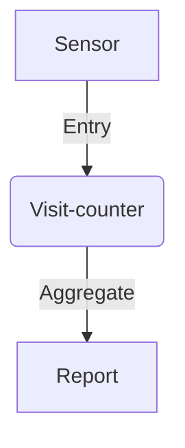

# Visit-counter Behavior

This project works out the features of a
visit-counting software, called the 'Visit-counter'.

Here's the context in which the Visit-counter works:

The sensor could be one of:

- foot-fall counter at the door
- entry-card issuer
- hospital staff attendance system

State the features of the visit-counter for the following stakeholders:

- Facilities manager (manages seating and parking)
- Director (ensures availability of beds and nursing staff)

Each feature would consist of scenarios.
Capture each scenario as:

- initial condition (Given...)
- event (When...)
- effect (Then...)

Place features given to each stakeholder in a different file.

As always, avoid passive voice :)
